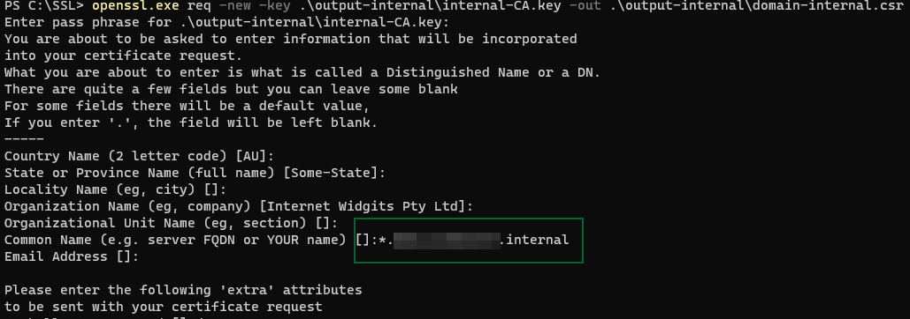
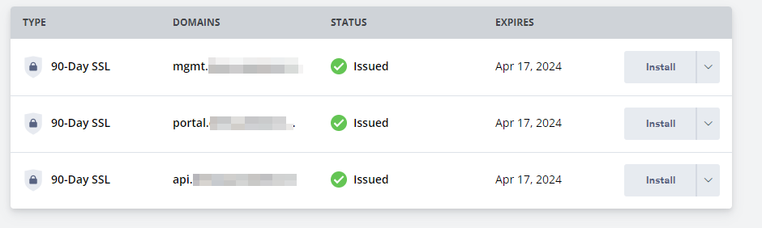
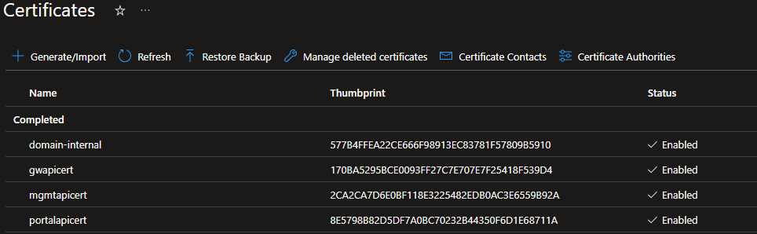

# Prerequisites
Create 1 wildcard certificate for the internal endpoints (gateway, portal and management endpoint).

## use openssl to create the certificates for the .internal domain

self-signed CA
```
#1 - create the root key
openssl.exe genrsa -des3 -out .\output-internal\internal-CA.key 4096

#2 - create and self sign the Root Certificate
openssl.exe req -x509 -new -nodes -key .\sample\internal-CA.key -sha256 -days 1024 -out .\output-internal\internal-rootCA-selfsigned.crt

#3 - Get CER of the root CA
openssl.exe x509 -inform pem -in .\output-internal\internal-rootCA-selfsigned.crt -outform der -out .\output-internal\internal-rootCA-selfsigned.cer
```

for the gateway, portal and management endpoint we create a wildcard certificate

!!! Don't forget to set the common name in step #3 !!!


```
#1 - Create the signing request
openssl.exe req -new -key .\output-internal\internal-CA.key -out .\output-internal\domain-internal.csr

#2 - check the CSR content
openssl.exe req -in .\output-internal\domain-internal.csr -noout -text

#3 - Generate the certificate using the mydomain csr and key along with the CA Root key
openssl.exe x509 -req -in .\output-internal\domain-internal.csr -CA .\output-internal\internal-rootCA-selfsigned.crt -CAkey .\output-internal\internal-CA.key -CAcreateserial -out .\output-internal\domain-internal.crt -days 500 -sha256

#4 - Create .pfx file from the .crt and private.key  (p@ssword)
openssl.exe pkcs12 -export -out .\output-internal\domain-internal.pfx -inkey .\output-internal\internal-CA.key -in .\output-internal\domain-internal.crt

```

result

```
│   internal-CA.key
│   internal-rootCA-selfsigned.cer
│   internal-rootCA-selfsigned.crt
│   internal-rootCA-selfsigned.srl
│
├───domain
       domain-internal.crt
       domain-internal.csr
       domain-internal.pfx

```

## create the certificates for the external domain
For this example I used https://www.zerossl.com/.



 To create the PFX from private key and CRT, I used the following commands.

```
openssl.exe pkcs12 -export -out gwapicert.pfx -inkey ".\ZeroSSL\api\private.key" -in ".\ZeroSSL\api\certificate.crt"

openssl.exe pkcs12 -export -out mgmtapicert.pfx -inkey ".\ZeroSSL\mgmt\private.key" -in ".\ZeroSSL\mgmt\certificate.crt" 

openssl.exe pkcs12 -export -out portalpicert.pfx -inkey ".\ZeroSSL\portal\private.key" -in ".\ZeroSSL\portal\certificate.crt"
```

## create the user assigned MSI

```
az identity create -g rg-bicep -n cgk-msi-dev-demo
```

## keyvault configuration

- create a keyvault
- load the internal and external certificates
- configure the access policies to grant access to the user-assigned managed identity (cgk-msi-dev-demo)

6 certificates have been uploaded



add the trusted root CA as secret to KeyVault

```
$vaultName = "cgk-key-dev-demo"
$secretName = "trustedrootca-domain-internal"
$certFilePath = "./internal-rootCA-selfsigned.cer"

$certData = get-content $certFilePath -Encoding Byte 
$certDataB64 = [System.Convert]::ToBase64String($certData)
$certDataSecure = ConvertTo-SecureString -String $certDataB64 -AsPlainText -Force

Set-AzKeyVaultSecret -VaultName $vaultName -Name $secretName  -SecretValue $certDataSecure -ContentType 'application/x-pkcs12'
```