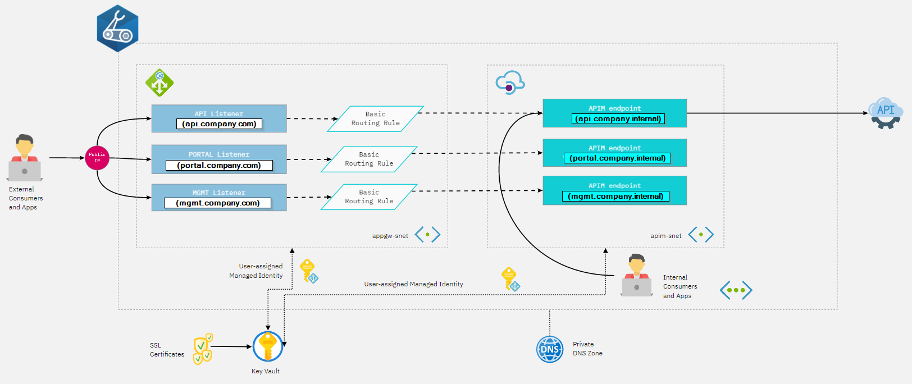
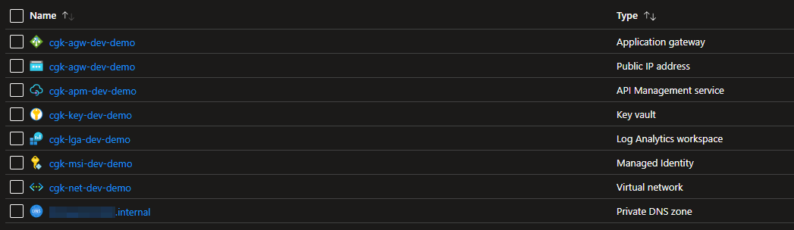

# bicep-appgw-apim
Deploy Azure Application Gateway and Azure API Management using Bicep DSL.

## scenario
This kind of infrastructure is commonly used to segregate internal and external API traffic and to enforce L4 (VNET + NSG) and L7 (WAF + APIM) protection.




## prerequisites
Certificates must be created upfront and loaded in KeyVault. Prerequisites are described [here](Prerequisites.md).

## deploy
```
 az deployment group create -f ./00main.bicep -g $rgname -p environment=dev -p uamsi=12345678-1234-1234-1234-123456789012 (=clientid)
```
result of the deployment.



## result

